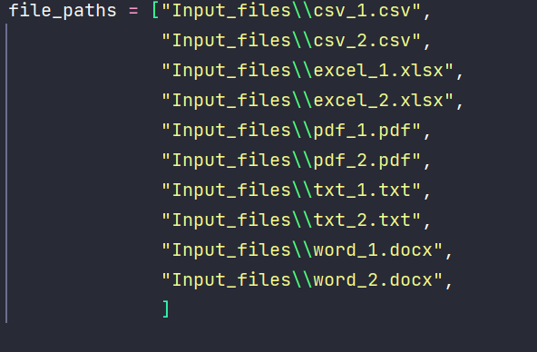
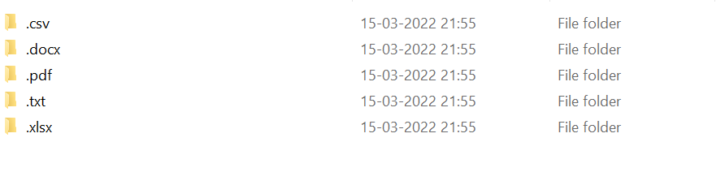
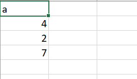
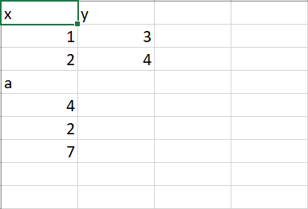
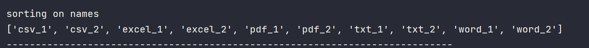
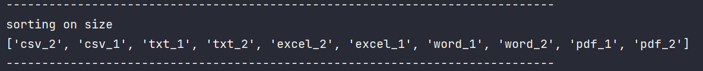

# File Manipulation Algorithm

An algorithm that can search, sort, and merge all sorts of file formats, as well as separate various file formats in our system by category and create folders for different file formats to store them.

# Different tasks performed by this algo and how they are achieved:

#### 1) Can perform search on the files present in the file system:
We could have used any algorithm to perform pattern matching like Rabin Karp, KMP etc.
But Naive Searching works well as well over here and hence it has been used.
This is because we just want to see if a pattern is present in a file name and not get all the indexes
where this pattern is present in a given text

#### 2) Can sort all the files:

We can sort either on the basis of name or size of files.

#### 3) Can merge files:

We perform merge on files having same extension. 
To achieve this, we read all the files at byte level. We use byte array to achieve the same.
To merge the files, we combine these different byte arrays. In the end, we get a merged file.

#### 4) Create folders for each file extension:

We can create different folders based on file extensions. 

To achieve this, we have stored all the file references in a dictionary.
The keys are file extensions and values are references to files of same extension.

We use mkdir to create folders and then use copyfile of shutil module to store different files in their respective folder.

# Navigation

File Manipulation: Package containing modules and classes for doing file manipulation like searching, sorting of files, creating folder for each extension etc.

folders: folder where all the different folders corresponding to different file extensions are stored.

logger: Package containing modules and classes for logging.

Merged_Files: folder storing the merged files.

staging: folder where all the files are stored so that manipulations can be done on them.
All the different files are copied into staging folder when object of File Manipulation is initialized.

# Screenshots

#### Input File Paths

//////////////////////////////////////////////////////////////////////////////////////////////

#### Folder created for each file

////////////////////////////////////////////////////////////////////////////////////////////////

#### CSV File 1

/////////////////////////////////////////////////////////////////////////////////////////////////

#### CSV File 2

///////////////////////////////////////////////////////////////////////////////////////////////////

#### Merged File

//////////////////////////////////////////////////////////////////////////////////////////////////////

#### Sorting on Names

//////////////////////////////////////////////////////////////////////////////////////////////////////

#### Sorting on Size

///////////////////////////////////////////////////////////////////////////////////////////////////////

#### Pattern Code

////////////////////////////////////////////////////////////////////////////////////////////////////////

#### Searched Files

/////////////////////////////////////////////////////////////////////////////////////////////////////////

